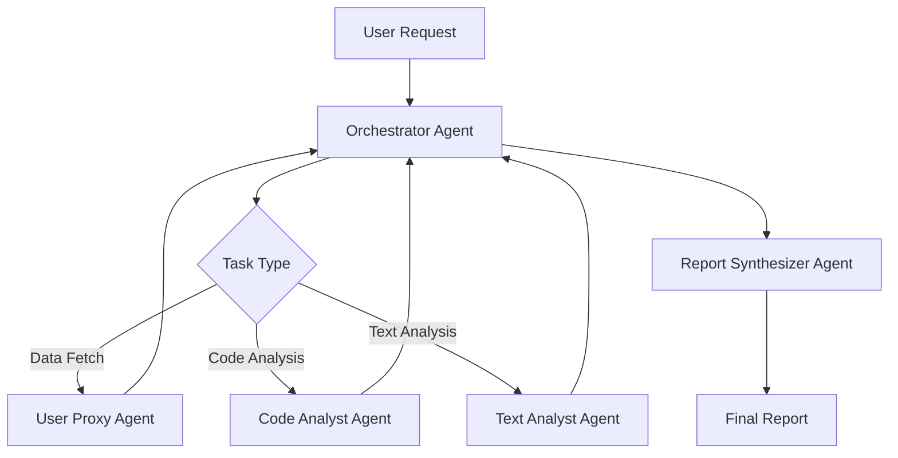

# LLM Agent Service (Multi-Agent Evaluation & Generation)

Multi-agent orchestration using Microsoft AutoGen (AgentChat) for question generation, hybrid scoring, report synthesis, and optional retrieval-augmented reasoning against a vectorized `KnowledgeBase` (Cosmos DB serverless vector account).

## 🚀 Features

### 🤖 Multi-Agent Architecture
- **Orchestrator Agent**: Manages workflow coordination and task delegation
- **Code Analyst Agent**: Evaluates coding submissions for correctness, quality, and efficiency
- **Text Analyst Agent**: Assesses descriptive answers for accuracy and clarity
- **Report Synthesizer Agent**: Compiles comprehensive assessment reports (aggregated structured scoring + LLM summaries)
- **User Proxy Agent**: Handles tool execution and administrative tasks

### 🔄 Advanced Workflow Management
- **SelectorGroupChat**: Intelligent agent selection based on conversation context
- **Custom Selector Functions**: Domain-specific workflow orchestration
- **Termination Conditions**: Smart conversation ending based on completion or limits
- **Message Streaming**: Real-time conversation monitoring and debugging

### 🛠️ Technical Capabilities
- **Azure OpenAI Integration**: Leverages GPT-5 family models (example: gpt-5-mini) for sophisticated reasoning
- **Tool Integration**: Seamless execution of assessment-specific functions
- **Caching & Performance**: Question generation and selective scoring re-use
- **Comprehensive Logging**: Detailed trace and event logging for debugging

## 📦 Installation

### Prerequisites
- Python 3.12+
- Azure OpenAI resource with GPT-5 family deployment (example: gpt-5-mini)
 
Note: In this repo "Smart Mock" / LLM-agent workflows typically reference GPT-5 family deployments (e.g., `gpt-5-mini`) for analysis and scoring. Live interview realtime features use separate realtime-enabled deployments (e.g., `gpt-4o-mini-realtime-preview`).
- Azure Cosmos DB (for data persistence)
- UV package manager (recommended) or pip

### Quick Setup

1. **Clone and Navigate**
   ```bash
   cd llm-agent
   ```

2. **Install Dependencies**
   ```bash
   # Using UV (recommended)
   uv sync
   
   # Or using pip
   pip install -r requirements.txt
   ```

3. **Configure Environment**
   ```bash
   cp .env.sample .env
   # Edit .env with your Azure OpenAI and Cosmos DB credentials
   ```

### Quick local-run checklist (concise)

1. Create and activate a Python 3.12+ virtualenv (PowerShell):

```powershell
python -m venv .venv; .\.venv\Scripts\Activate.ps1
```

2. Sync dependencies with `uv`:

```powershell
cd llm-agent
uv sync
```

3. If you need AutoGen Studio tooling locally, install the pre-release manually into your venv (it constrains autogen-ext < 0.7 so we do NOT include it in `uv` deps):

```powershell
pip install autogenstudio==0.4.3.dev2 --no-deps
```

4. Copy `.env.sample` to `.env` and fill required values (see the Configuration section below). For RAG, set `RAG_COSMOS_DB_*` and `AZURE_OPENAI_EMBED_DEPLOYMENT`.

5. Quick import test (from the activated venv):

```powershell
python -c "import sys; sys.path.insert(0, r'..\\llm-agent'); import agents; print('agents import OK')"
```

If you see `agents import OK`, core runtime wiring looks good.

## RAG (vector) provisioning notes

- Use a separate, serverless/vector-enabled Cosmos account for the KnowledgeBase to avoid RU contention with transactional workloads.
- Provision the KnowledgeBase container ahead of time with a vector index. The embedding dimension must match the chosen embedding model (set `AZURE_OPENAI_EMBED_DEPLOYMENT` in `.env`).
- Avoid auto-creating vector-enabled containers from application code in production; provision via CLI/portal/IaC with the correct index policy.

Minimal Azure CLI example (illustrative):

```powershell
# Create resource group and serverless Cosmos account
az group create -n rg-llm -l eastus
az cosmosdb create -n my-rag-cosmos -g rg-llm --capabilities EnableServerless

# Create database and container (example)
az cosmosdb sql database create -a my-rag-cosmos -g rg-llm -n ci-rag-database
az cosmosdb sql container create -a my-rag-cosmos -g rg-llm -d ci-rag-database -n KnowledgeBase --partition-key-path "/id"
```

Refer to Azure docs for vector-index details and embedding dimension matching.


4. **Start the Service**
   ```bash
   # Using UV
   uv run uvicorn main:app --host 0.0.0.0 --port 8000 --reload
   
   # Or directly
   python main.py
   ```

## 🔧 Configuration

### Environment Variables (Core)

The service requires several key environment variables in your `.env` file:

```bash
# Azure OpenAI Configuration
AZURE_OPENAI_ENDPOINT=https://your-resource.openai.azure.com/
AZURE_OPENAI_API_KEY=your-api-key
AZURE_OPENAI_DEPLOYMENT_NAME=gpt-5-mini
## AZURE_OPENAI_MODEL removed; use AZURE_OPENAI_DEPLOYMENT_NAME to specify the Azure deployment (e.g. gpt-5-mini)
AZURE_OPENAI_API_VERSION=2024-09-01-preview

# AutoGen Logging
AUTOGEN_ENABLE_TRACE_LOGGING=true
AUTOGEN_ENABLE_EVENT_LOGGING=true
AUTOGEN_LOG_LEVEL=INFO

# Cosmos DB (Primary transactional)
COSMOS_DB_ENDPOINT=https://<primary-account>.documents.azure.com:443/
COSMOS_DB_KEY=<primary-key>

# Optional RAG / Vector account (KnowledgeBase)
RAG_COSMOS_DB_ENDPOINT=https://<rag-account>.documents.azure.com:443/
RAG_COSMOS_DB_KEY=<rag-key>
RAG_COSMOS_DB_DATABASE=ragdb
```

### Azure AD Authentication (Recommended for Production)

For enhanced security, leave `AZURE_OPENAI_API_KEY` empty and configure Azure AD:

```bash
AZURE_CLIENT_ID=your-client-id
AZURE_CLIENT_SECRET=your-client-secret
AZURE_TENANT_ID=your-tenant-id
```

## 🎯 API Endpoints

### Generate Assessment Report
```http
POST /generate-report
Content-Type: application/json

{
  "submission_id": "submission-12345"
}
```

Workflow summary:
1. Fetch submission summary + referenced question snapshots
2. Deterministic MCQ scoring
3. Code analysis (complexity / correctness reasoning)
4. Descriptive / free-text evaluation (rubric + LLM semantic checks)
5. Persist full evaluation artifact in `evaluations` (PK `/submission_id`)
6. Return synthesized report stub with pointer to stored artifact

### Generate Questions
```http
POST /generate-question
Content-Type: application/json

{
  "skill": "Python Programming",
  "question_type": "coding",
  "difficulty": "intermediate"
}
```

Uses AI agents to generate contextually appropriate assessment questions.

### Quick Assessment
```http
POST /assess-submission
Content-Type: application/json

{
  "submission_id": "submission-12345"
}
```

Provides streamlined scoring without full report generation.

### Health Check
```http
GET /health
```

Returns service health status and agent availability.

### Agent Status
```http
GET /agents/status
```

Detailed information about all agents and their current status.

## 🛠️ Development & Testing

### AutoGen Studio Integration

For visual workflow design and testing:

1. **Install AutoGen Studio**
   ```bash
   uv add --dev autogen-studio
   ```

2. **Start AutoGen Studio**
   ```bash
   python autogen_studio_config.py --start
   ```

3. **Access Web UI**
   Open http://localhost:8081 for visual agent workflow design

### Logging and Debugging

The service includes comprehensive logging:

- **Trace Logging**: Detailed agent communication flows
- **Event Logging**: Structured messages and decision points
- **Application Logging**: Service-level events and errors

Enable debug logging:
```bash
AUTOGEN_LOG_LEVEL=DEBUG
AUTOGEN_ENABLE_TRACE_LOGGING=true
```

### Running Tests

```bash
# Install test dependencies
uv add --dev pytest pytest-asyncio

# Run tests
uv run pytest tests/
```

## 🐳 Docker Deployment

### Build Image
```bash
docker build -t llm-agent-service .
```

### Run Container
```bash
docker run -p 8000:8000 --env-file .env llm-agent-service
```

### Production Deployment
```bash
# With health checks and resource limits
docker run -d \
  --name llm-agent \
  --restart unless-stopped \
  -p 8000:8000 \
  --env-file .env \
  --memory=2g \
  --cpus="1.0" \
  llm-agent-service
```

## 🏗️ Architecture

### Agent Workflow



### Technology Stack

- **Framework**: Microsoft AutoGen AgentChat
- **API**: FastAPI with async support
- **AI Model**: Azure OpenAI GPT-5 family (example: gpt-5-mini)
- **Database**: Azure Cosmos DB
- **Authentication**: Azure AD / API Keys
- **Logging**: Python logging with AutoGen integration
- **Containerization**: Docker with multi-stage builds

## 🔄 Agent Communication

The service uses Microsoft AutoGen's SelectorGroupChat pattern:

1. **Intelligent Selection**: Agents are selected based on conversation context
2. **Custom Workflows**: Domain-specific selector functions for assessment tasks
3. **Termination Handling**: Smart conversation ending based on completion criteria
4. **Tool Integration**: Seamless execution of assessment-specific functions

### Message Flow

```python
# Example workflow coordination
def assessment_selector_func(messages):
    last_message = messages[-1]
    
    if "fetch" in last_message.content.lower():
        return user_proxy_agent.name
    elif "code" in last_message.content.lower():
        return code_analyst_agent.name
    elif "report" in last_message.content.lower():
        return report_synthesizer_agent.name
    
    return orchestrator_agent.name
```

## 📊 Performance & Scaling

### Optimization Features
- **Async Operations**: Full async/await support for concurrent processing
- **Connection Pooling**: Efficient Azure OpenAI client management
- **Caching**: Question generation with intelligent caching
- **Resource Management**: Proper cleanup and connection closing

### Scaling Considerations
- **Horizontal Scaling**: Stateless service design for multi-instance deployment
- **Resource Limits**: Configurable agent timeouts and iteration limits
- **Cost Management**: Efficient token usage and conversation optimization

## 🚨 Error Handling

The service includes comprehensive error handling:

- **Agent Failures**: Graceful degradation with fallback responses
- **API Errors**: Detailed error messages with status codes
- **Timeout Handling**: Configurable timeouts for long-running operations
- **Resource Cleanup**: Automatic cleanup of connections and resources

## 📈 Monitoring

### Health Checks
- Service availability endpoint
- Agent status monitoring
- Model client connectivity verification

### Metrics
- Assessment completion rates
- Agent performance metrics
- Response time monitoring
- Error rate tracking

## 🔐 Security

### Authentication
- Azure AD integration for production environments
- API key support for development
- Environment-based configuration

### Best Practices
- No sensitive data in logs
- Secure environment variable handling
- Proper Azure RBAC integration
- Network security considerations

## 📚 Additional Resources

- [Microsoft AutoGen Documentation](https://microsoft.github.io/autogen/)
- [Azure OpenAI Service](https://docs.microsoft.com/azure/cognitive-services/openai/)
- [AutoGen AgentChat Guide](https://microsoft.github.io/autogen/stable/user-guide/agentchat-user-guide/)
- [SelectorGroupChat Tutorial](https://microsoft.github.io/autogen/stable/user-guide/agentchat-user-guide/tutorial/teams.html)

## 🤝 Contributing

1. Fork the repository
2. Create a feature branch
3. Implement changes with tests
4. Update documentation
5. Submit a pull request

## 📄 License

This project is licensed under the MIT License – see the repository root LICENSE file.

---

**Built with Microsoft AutoGen AgentChat Framework** 🚀
